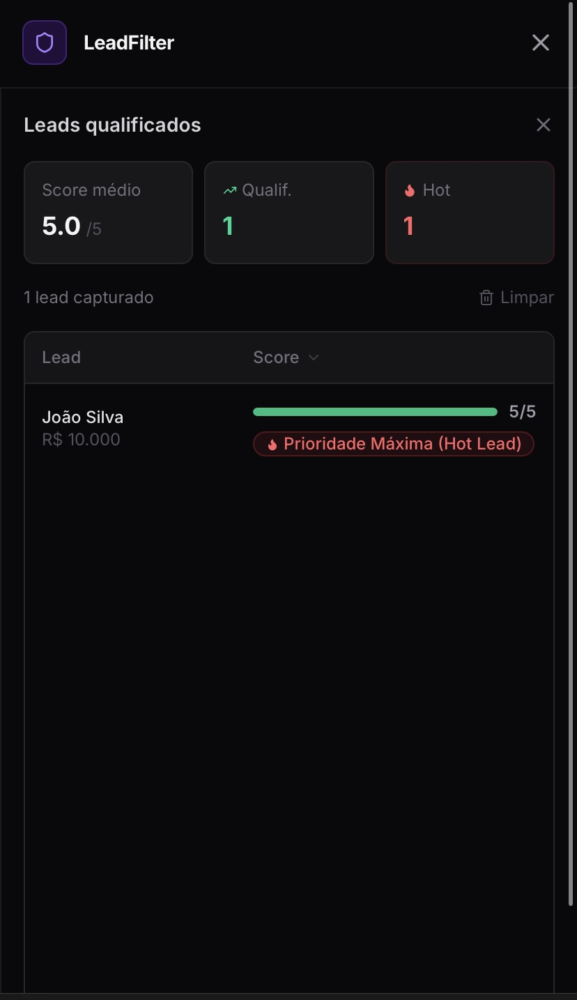
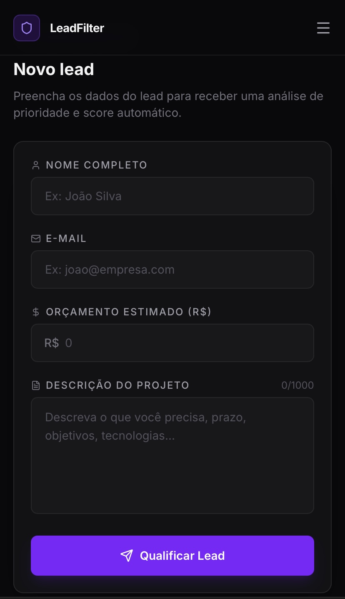

# Lead Qualifier Dashboard 

[](https://nodejs.org/)
[](https://reactjs.org/)
[](https://tailwindcss.com/)

Um painel analítico desenvolvido em React para visualização e qualificação automática de leads em tempo real. Este projeto foca em transformar dados brutos de cadastro em indicadores visuais para tomada de decisão estratégica.

---

## O Projeto em Ação

Esta é a visão principal do dashboard, exibindo as métricas consolidadas e a listagem de leads já processados pelo algoritmo de scoring.



---

## Sobre e Diferenciais Técnicos

O **Lead Qualifier** resolve a necessidade de visualizar grandes volumes de dados de forma intuitiva. Ele utiliza uma interface moderna para exibir métricas de performance, taxas de conversão e scoring de leads, permitindo que a equipe de vendas identifique oportunidades com maior precisão.

### Destaques Técnicos:
- **Fluxo Completo de Aplicação:** Captura de dados via formulário e listagem reativa.
- **Lógica de Scoring Reativa:** Componentes visualizam dinamicamente o score (ex: 5.0/5) e aplicam tags de prioridade (ex: "Hot Lead").
- **Estilização Moderna:** Uso de Tailwind CSS para um design "Dark Mode" responsivo, com foco em hierarquia visual.
- **Clean Code:** Estrutura de componentes organizada para facilitar a manutenção e escalabilidade.

---

## Tecnologias Utilizadas

- **Frontend:** React.js (Hooks, Component-Based Architecture)
- **Estilização:** Tailwind CSS (Design Utilitário)
- **Ambiente:** Node.js v24 (Desenvolvido via Termux/Android)

---

## Funcionalidades e Fluxo

O sistema funciona através de um fluxo intuitivo de cadastro e análise:

| 1. Captura de Dados (Formulário) | 2. Visualização e Análise (Dashboard) |
| :--- | :--- |
|  |  |
| O usuário preenche os dados do lead, incluindo orçamento e descrição do projeto. | O sistema processa o score e exibe o lead com sua prioridade na lista. |

---

## Como Executar o Projeto

Como este projeto utiliza uma abordagem de carregamento via CDN para compatibilidade com diversos ambientes, você pode rodá-lo de forma simples:

1. Clone o repositório:
   ```bash
   git clone [https://github.com/Rafazxk/Lead-Qualifier-Dashboard.git](https://github.com/Rafazxk/Lead-Qualifier-Dashboard.git)

2. Abra o arquivo index.html diretamente no seu navegador ou utilize um servidor estático simples:

   ```bash
   # Opção 1: Usando o serve do Node
     npx serve .

   # Opção 2: Usando Python
     python -m http.server 8080
   ```
---
Desenvolvido por Rafael Silva - Estudante de ADS no 5º período.
